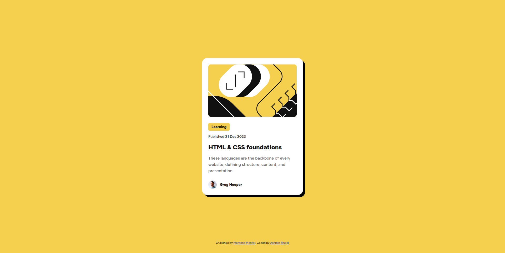
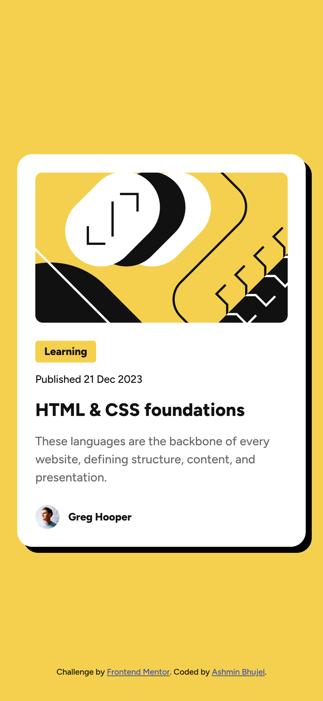

# Frontend Mentor - Blog Preview Card Solution

This is a solution to the [Blog preview card challenge on Frontend Mentor](https://www.frontendmentor.io/challenges/blog-preview-card-ckPaj01IcS). Frontend Mentor challenges help you improve your coding skills by building realistic projects.

## Table of Contents

- [Overview](#overview)
  - [Screenshot](#screenshot)
  - [Links](#links)
- [My process](#my-process)
  - [Built with](#built-with)
- [Author](#author)

## Overview

### Screenshot

#### Desktop Version

#### Mobile Version

### Links

- Solution URL: [GitHub link](https://github.com/Ashmin-Bhujel/blog-preview-card)
- Live Site URL: [GitHub pages link](https://ashmin-bhujel.github.io/blog-preview-card/)

## My Process

### Built with

- Semantic HTML5 markup
- CSS custom properties
- CSS Nesting
- CSS Flexbox

## Author

- Frontend Mentor - [@Ashmin-Bhujel](https://www.frontendmentor.io/profile/Ashmin-Bhujel)
- X (Formerly Twitter) - [@ashmin_bhujel](https://www.x.com/ashmin_bhujel)
